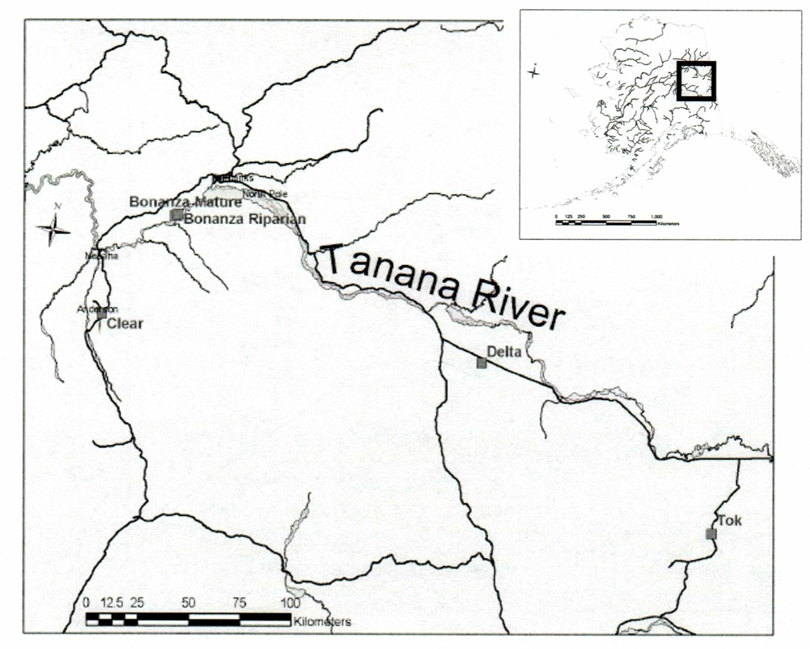

```{r setup, include=FALSE}
knitr::opts_chunk$set(echo = TRUE, warning = FALSE, message = FALSE)
library(tidyverse)
library(here)
library(ggpubr)
library(broom) 
library(lubridate)
library(kableExtra)
library(effsize)
library(ggbeeswarm)
```

## 1. Overview

This report provides an exploratory overview of differences in juvenile Snowshoe hare weights observed across three study sites(Bonanza Black Spruce, Bonanza Mature, and Bananza Riparian) in the Bonanza Creek Experimental Forest, located in the Tanana Valley in Alaska from 1999-2012 (Kielland et al. 2017). Specifically, hare weights are compared across three study sites, broken out by sex to account for sexual dimorphism within a species. Additionally, the relationship(s) between hind foot length and body mass are explored. 

## 2. Data and methods

Snowshoe structural size measurement data were collected in a capture re-capture study and made available by Knut Kielland and colleagues at the Bonanza Creek Experimental Forest, part of the Bonanza Creek Long Term Ecological Research (LTER) network site located near Fairbanks, Alaska. The data contain 378 observations for juvenile Snowshoe hares collected from 1999-2012. Following exploratory data visualization, body weight between male and female hares are compared by unpaired two-sample t-tests using a significance level ($\alpha$) of 0.05 throughout. Difference between groups are described by Cohen’s *d* effect size. The relationship between hind foot length and body weight is explored by simple linear regression. All analyses are in R version 4.0.2 using RStudio version 1.4.1717.

<center> {width=70%} </center>

**Figure 1.** Map of snowshoe hare observations in the Bonanza LTER network site from Bjorn Flora (2002).

## 3. Preliminary results

```{r echo = FALSE}
# read in the data
hares <- read_csv(here("data", "bonanza_hares.csv"))
```

### A. Annual juvenile hare trap counts

```{r echo = FALSE, fig.align = "center"}

# wrangle the data
juvenile_hares <- hares %>% #create new data frame
  filter(age == "j") %>% #filter for juveniles only
  mutate(date_new = mdy(date)) %>% #mutate date format
  mutate(year = year(date_new)) %>% #create new column
  group_by(year) #group by year

# visualize the data
juvenile_hares_year <- juvenile_hares %>% #create new data frame
  group_by(year) %>% #group by year
  summarize(total_counts = n()) #summarize total counts (total all observations for year)

ggplot(data = juvenile_hares, aes(x = year)) + #create ggplot, define x-axis
  geom_histogram(fill = "lightblue3", #customize colors
                 color = "lightblue4",
                 binwidth = .5) + #customize bin size for aesthetics 
  scale_x_continuous(breaks = 1999:2012) + #customize x-axis breaks
  scale_y_continuous(breaks = c(0, 25, 50, 75, 100, 125)) + #customize y axis breaks
  theme_light() + #customize theme
  labs(x = "Year", #update axis labels
       y = "Total Hare Counts (n)")

# Data Analysis: Calculations of mean/median & min/max to help interpret the data visualization
juvenile_hares_year_stats <- juvenile_hares_year %>% #create new data frame
  summarize( #calculate stats on total_counts column values
    mean = mean(total_counts),
    median = median(total_counts),
    min = min(total_counts),
    max = max(total_counts)
  )

```

**Figure 2.** This graph shows the total counts of Bonanza LTER juvenile snowshoe hare trappings across all three study sites between 1999 and 2012.

The minimum count of juvenile hare trappings is `r juvenile_hares_year_stats[1,3]` and the maximum count is `r juvenile_hares_year_stats[1,4]`. A notable trend these values indicate is a decline in juvenile snowshoe traps over time. The mean count of juvenile hare trappings is `r juvenile_hares_year_stats[1,1]` and the median is `r juvenile_hares_year_stats[1,2]`. The data used in this report are absolute counts, but does not take into consideration the impact of effort, or number of days and number of traps used in the study each year. These factors would need to be taken into consideration for future analyses to standardize the juvenile hare population.   


### B. Visualize juvenile hare weights


```{r echo = FALSE, fig.align = "center"}
# wrangle the data

juvenile_hare_weights <- juvenile_hares %>% #create new data frame
  select(grid, sex, weight) %>% #select 3 columns
  mutate(grid = case_when(grid == "bonmat" ~ "Bonanza Mature", #convert abbreviation to full name
                               grid == "bonbs" ~ "Bonanza Black Spruce",
                               grid == "bonrip" ~ "Bonanza Riparian")) %>%
  mutate(sex = case_when(sex == "f" ~ "Female", #convert data from f to female
                               sex == "m" ~ "Male", #convert data from m to
                         TRUE ~ "Unknown")) #convert data from NA to unknown

# visualize the data
ggplot(data = juvenile_hare_weights, aes(x = sex, y = weight)) + #create a ggplot
  geom_beeswarm(aes(color = sex), width = 0.25) + #specify jitter plot, differentiate sex by color
  facet_wrap(~grid) + #facet wrap data based on study site name
  scale_color_manual(values = c("coral3", #customize colors
                               "cadetblue4", 
                               "peachpuff4")) +
  geom_boxplot(fill = NA, width = 0.4, outlier.color = NA) + #add box plots to graph, set box width
  stat_summary(fun=mean, #statistical summary of means as the function
               geom="point", 
               shape=5, # set shape to diamond for mean
               size=2, # set size of mean shape
               color="black", #set colors
               fill="black") +
  theme_light() + #customize theme
  theme(legend.position = "none") +
  labs(x = "\nHare Sex", y = "Weight (grams)\n") #customize axis labels
```

**Figure 3.** This graph shows the distribution of juvenile snowshoe hare weights by sex across three study sites. Coral (female), blue (male), and gray (Unknown) points indicate individual observations for hare weight of a juvenile snowshoe hare. Unknown observations are included, and are observations where the weights were recorded but sex was not. Box endpoints indicate the 25^th^ and 75^th^ percentile values; the black line and black point within the box indicate the median and mean value for each species, respectively. Data: Kielland et al. (2017).

This visualization shows that both male and female juvenile snowshoe hare weights appear to be normally distributed across all three sites. This appears to be the case even though the Bonanza Riparian site has far more observations than the other two sites. The number of observations could be attributed to actual population size at each site or due to the effort in collecting data at each site, which should be considered for future analyses.   


### C. Juvenile weight comparison (male & female snowshoe hares)


```{r echo = FALSE, fig.align = "center"}
juvenile_stats <- juvenile_hare_weights %>% #create new data frame
  group_by(sex) %>% #group by species sex
  summarize( #calculate stats
    mean_weight = round(mean(weight, na.rm = TRUE),2),
    sd_weight = round(sd(weight, na.rm = TRUE),2),
    trappings = n())

# finalized summary table of statistical analysis (quantitative)
kable(juvenile_stats, #create finalized table
      col.names = c("Sex", #customize table column names
                    "Mean Weight (g)",
                    "Standard Deviation (g)",
                    "Sample Size (n)"),
      align = "c", #center columns
      caption = "Table 1: Descriptive statistics (mean, standard deviation, and sample size) for male and female juvenile snowshoe hares. Data: Keilland et al. 2017") %>% #add table caption
  kable_paper() #customize table style

# create mean difference and mean percent calculations for using in-line text

mean_diff <- juvenile_stats[2, "mean_weight"] - juvenile_stats[1, "mean_weight"]

```


```{r echo = FALSE, include = FALSE}
# T-test code:

# Split data into groups (male/female) then pull sample vectors for unpaired two-sample t-test

# Pull vectors of weights for male and female juvenile snowshoe hares

male_hares <- juvenile_hare_weights %>% #create new data frame
  filter(sex == "Male") %>% #filter for males only
  pull(weight) #extract a single column


female_hares <- juvenile_hare_weights %>% #create new data frame
  filter(sex == "Female") %>% #filter for females only
  pull(weight) #extract a single column

# Plot histogram & qq-plots to check assumptions
hist(male_hares) # looks normal
qqnorm(male_hares) # relatively linear
hist(female_hares) # looks normal
qqnorm(female_hares) # looks very linear

# Overall: assumptions of normality hold. Two-sample t-test OK for means of comparison. 

# Now run an unpaired two-sample t-test
juvenile_hare_ttest <- t.test(male_hares, female_hares, na.rm = TRUE)

# Get the tidy data model results to call outputs in-line:
juvenile_hare_ttest_tidy <- tidy(juvenile_hare_ttest)

# Get the means & standard deviations for each:
male_mean <- mean(male_hares)
female_mean <- mean(female_hares, na.rm = TRUE) # remove NA values
male_sd <- sd(male_hares)
female_sd <- sd(female_hares, na.rm = TRUE) # remove NA values

# Get the effect size:
juvenile_hare_effsize <- cohen.d(male_hares, female_hares, na.rm = TRUE)

juvenile_hare_effsize

```

On average, juvenile male snowshoe hares have larger body weights than juvenile female snowshoe hares (`r round(male_mean,2)` $\pm$ `r round(male_sd, 2)` and `r round(female_mean,2)` $\pm$ `r round(female_sd,2)` grams, respectively;  mean $\pm$ 1 standard deviation). While the absolute difference in means is `r round(male_mean,2) - round(female_mean, 2)` grams (a `r round((male_mean - female_mean)/((male_mean + female_mean)/2)*100, 2)` % difference), the difference in means is statistically significant (Welch's two-sample t-test: t(`r round(juvenile_hare_ttest_tidy$parameter,2)`) = `r round(juvenile_hare_ttest_tidy$statistic, 2)`, p = 0.007), and the effect size is small (Cohen's *d* = `r round(juvenile_hare_effsize$estimate, 2)`).

### D. Relationship between juvenile weight & hind foot length

As a starting point, the relationship between hind foot length and body weight was explored for all juvenile snowshoe hares (i.e. ignoring sex); further analysis is needed to compare the relationship between hind foot length and body weight. 

```{r echo = FALSE, include = FALSE}

# Wrangle the data

juvenile_hares_foot <- juvenile_hares %>% 
  select(weight, hindft, sex)

# Do linear regression
hare_lm <- lm(weight ~ hindft, data = juvenile_hares_foot)

# Get tidy versions of the model output to call later on in text
hare_lm_tidy <- tidy(hare_lm)
hare_lm_glance <- glance(hare_lm)

#See model diagnostics:
plot(hare_lm)

# Get Pearson's r correlation
hare_cor <- cor.test(juvenile_hares_foot$weight, juvenile_hares_foot$hindft)

# Tidy version of correlation output:
hare_cor_tidy <- tidy(hare_cor)

```


The relationship between hind foot length(mm) and body weight (g) does not appear to be completely linear (Figure 4). Simple linear regression revealed that hind foot length significantly predicts body weight (p < 0.001, R^2^ = `r round(hare_lm_glance$r.squared,2)`) with an average slope of $\beta$ = `r round(hare_lm_tidy$estimate[2], 2)` g mm^-1^ (i.e., for each one millimeter increase in hind foot length we expect an average increase in body mass of `r round(hare_lm_tidy$estimate[2], 2)` g). Hind foot length and body weight are moderately positively correlated (Pearson's *r* = `r round(hare_cor_tidy$estimate,2)`, p < 0.001). Diagnostic plots (not included in this report) reveal non-normal distributions and heteroscedastic residuals. 


```{r echo = FALSE, fig.align = "center"}
# Visualize the data

ggplot(data = juvenile_hares_foot, aes(x = hindft, y = weight)) + #create a graph
  geom_point(color = "turquoise4") + #specify plot type
  geom_smooth(method = "lm", se = FALSE, color = "black") + #linear regression model & customization
  theme_light() + #customize theme
  labs(x = "\nHind Foot Length (mm)", #customize axis labels
       y = "Weight (g)\n")
```

**Figure 4.** Relationship between hind foot length(mm) and body mass (g) in juvenile snowshoe hares. Points indicate individual juvenile snowshoe hare measurements. Linear model summary: $\beta$ = `r round(hare_lm_tidy$estimate[2], 2)` g mm^-1^, p < 0.001, R^2^ = `r round(hare_lm_glance$r.squared,2)`, Pearson's *r* = `r round(hare_cor_tidy$estimate,2)`). Data: Kielland et al. (2017).


## Summary

Exploratory data analysis reveals the following initial findings:

- There are inconsistencies in the the total number of juvenile snowshoe hare trappings over the duration of the study; for some years (2002 & 2009) no trappings/observations were made at all.

- On average, juvenile male snowshoe hares have larger body weights than juvenile female snowshoe hares. The absolute difference in means is `r round(male_mean,2) - round(female_mean, 2)` grams. This difference is statistically significant, and has a small effect size (Cohen's *d* = `r round(juvenile_hare_effsize$estimate, 2)`).

- The relationship between hind foot length (mm) and body weight (grams) does not appear to be best described by a simple linear regression model. With this simple linear regression model, only `r round(hare_lm_glance$r.squared,2)*100` % of the variance in hind foot length is predictable based on body weight. In summary, a different type of model may be more appropriate to understand the relationship between hind foot length and body weight.  

## Citations

Kielland, K., F.S. Chapin, R.W. Ruess, and Bonanza Creek LTER. 2017. Snowshoe hare physical data in Bonanza Creek Experimental Forest: 1999-Present ver 22. Environmental Data Initiative. https://doi.org/10.6073/pasta/03dce4856d79b91557d8e6ce2cbcdc14